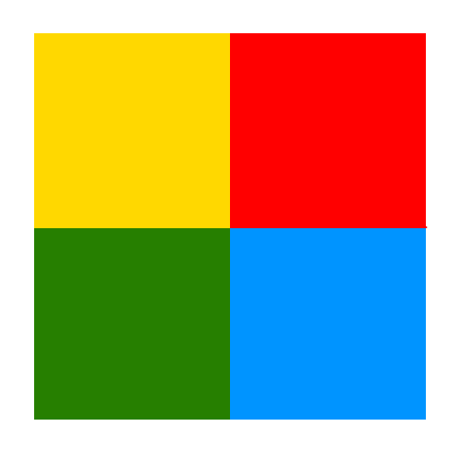

<p align="center"></p>

**wxw** is a collection of tools for the windows operating system.

It can be used as a node module or as a command line tool.

## command line

```sh
npm install -g wxw

wxw help

wxw [command] [args...]

    commands:

         info       [id|title]
         raise       id
         minimize    id
         maximize    id
         restore     id
         focus       id
         close       id
         bounds      id x y w h
         launch      path
         mouse
         help        command
         folder      name
         trash       empty|count
         taskbar     hide|show
         screen     [size|user]
         screenshot [targetfile]

    id:

         process id
         executable path
         window handle
         nickname

    nickname:

         top|topmost|front|frontmost|foreground
         taskbar

```

## node module

```coffeescript

wxw = require('wxw'); # a thin wrapper around the executable

console.log wxw('info', 'top')

# [
#   {
#     path: 'C:\\msys64\\usr\\bin\\mintty.exe',
#     title: '/c/Users/kodi/s/wxw',
#     hwnd: '8f04c6',  ◂◂◂ use this to control a single window
#     pid: 12384,
#     x: 15,
#     y: 314,
#     width: 1302,
#     height: 1530,
#     zindex: 40,
#     status: 'normal'
#   }
# ]

wxw('minimize', '8f04c6')
wxw('launch',   'firefox')
wxw('trash',    'empty')

```
